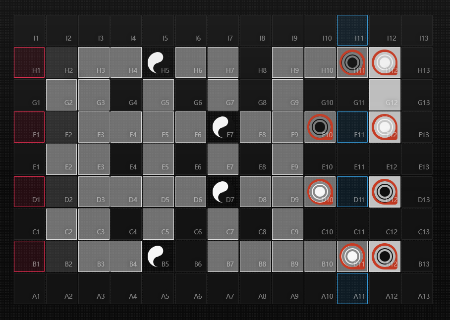
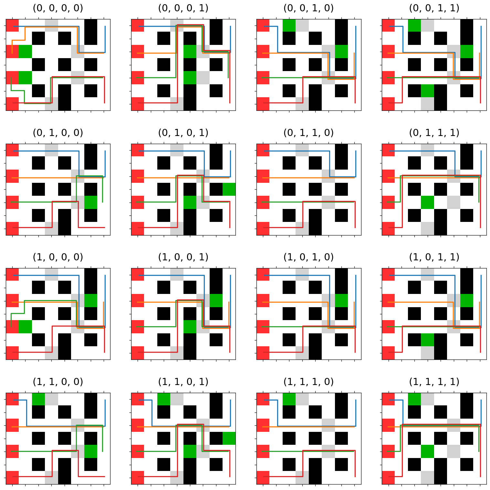
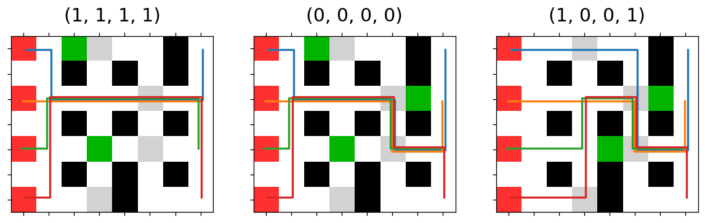
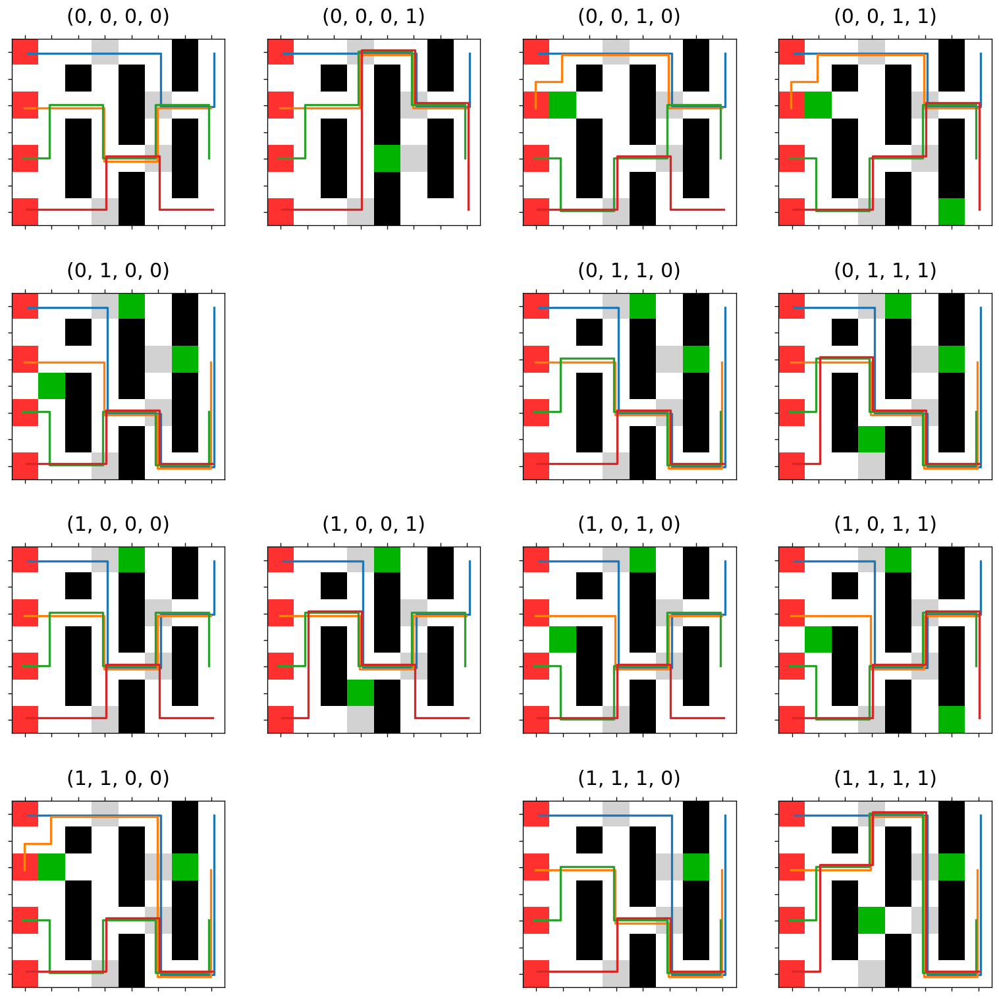
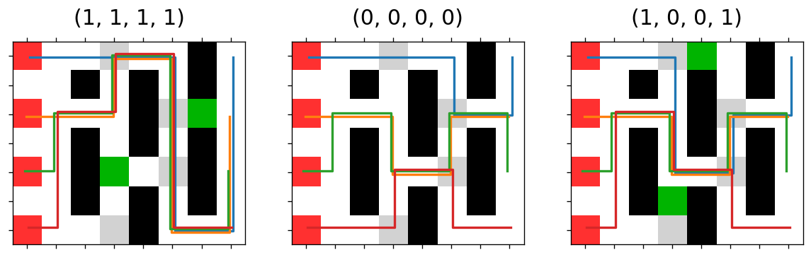

# ArkPath
明日方舟地图路径计算+调箱穷举  
脚本使用python3编写，直接运行 
```
python ArkPath.py
```
结果图像会输出到py文件所在文件夹下


## 地图标识
- -3：出怪点，可通行，不可放置箱子
- -2：不考虑放置箱子地块，可通行，不可放置箱子
- -1：朝暮之印所在地块，可通行，不可放置箱子
- 0：可放置箱子地块，可通行，可放置箱子
- 1：箱子（可撤退），不可通行
- 2：不可破坏地形，不可通行

 

部分地块防止箱子后堵死蓝门，标记为-2  
部分地块完全等价，如(H6,H7,G7)，(C7,B7,B8)等。对这部分地块，每组仅保留一个作为可放置地块，其余均置为-2

## 寻路算法
寻路算法为A\*算法，实现方法参考 https://zhuanlan.zhihu.com/p/54510444  
算法中关于同距离路径选择的优先级：  
- 优先向右
- 若不能向右，优先向地图中线行动

## 运行结果
### 普通
- 各状态最优解  

- 整体最优解  

### 突袭
- 各状态最优解  

- 整体最优解  

空白部分为无解情况  
注意到由于突袭初始不放箱子状态即为第二波(0,0,0,0)的解，因此突袭每波取箱子最少情况即得到最优解